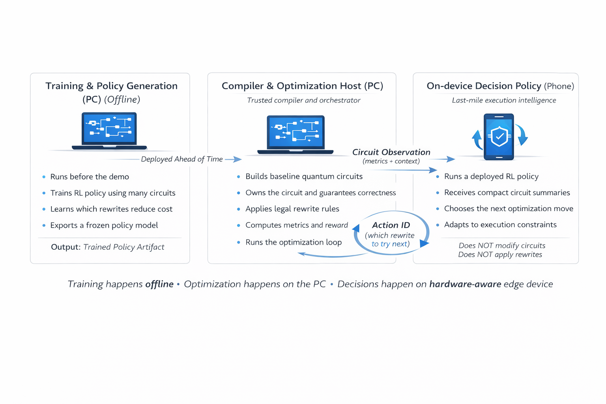

# Quantum Multiverse Optimizer

Multi-device RL-based quantum circuit optimizer demo for the Snapdragon Multiverse Hackathon.

  

# Hardware-Aware Quantum Circuit Optimization

## Project Overview

Quantum computing is an emerging field with the potential to solve problems that are intractable for classical computers. While quantum hardware is rapidly improving, a major challenge remains: **how do we actually use these machines effectively?**

Quantum programs are not written like classical code. Instead, they are expressed as **quantum circuits**, which obey strict physical rules:
- Operations must be reversible  
- Information cannot be freely copied  
- All transformations must preserve quantum correctness  

Because of these constraints, quantum circuits cannot be optimized using traditional compiler techniques. To run efficiently on real hardware, they must be transformed using **legal rewrite rules** that reduce cost (such as circuit depth or noise sensitivity) without changing behavior.

Our project addresses this exact problem.

---

## Core Idea: Optimization as Reinforcement Learning

We frame quantum circuit optimization as a **reinforcement learning (RL)** problem.

Starting from a correct but unoptimized quantum circuit, an RL agent learns how to apply valid circuit rewrites that improve performance according to quantum-specific cost functions. Each action preserves correctness while moving the circuit toward a more hardware-efficient form.

This enables automated, scalable optimization that would be infeasible to perform manually.

---

## Offline Training (PC)

The RL agent is trained **offline on a PC**, where it learns:
- Which circuit rewrites are legally allowed  
- How transformations affect quantum cost metrics  
- Multi-step optimization strategies  

This phase is hardware-agnostic and produces a **frozen policy** that is later used for inference.

---

## Edge Inference: Representing Quantum Hardware

In real quantum systems, hardware conditions change frequently. Noise levels, connectivity, and error rates can vary from moment to moment, and optimization decisions should reflect these conditions.

In our system, this role is represented by an **edge device**, implemented here as an Android phone.

> The phone does **not** represent a consumer device.  
> It symbolically represents a hardware-aware endpoint that lives alongside quantum computers.

The edge node:
- Knows current hardware constraints  
- Runs **RL inference only** (no training)  
- Advises which optimization move is best *at that moment*

---

## Hardware-Aware Optimization Loop

The optimization process proceeds as an iterative loop:

1. The PC selects a quantum circuit and computes its current cost.
2. The circuit specification and cost context are sent to the edge node.
3. The edge node runs RL inference using live hardware constraints.
4. The edge node returns the next legal optimization move.
5. The PC applies the rewrite, recalculates cost, and repeats.

This loop continues until the circuit reaches an optimized form.

**Key guarantees:**
- The PC is the **system of record**
- The edge node never modifies the circuit directly
- Circuit correctness is enforced at every step

---

## Why This Architecture Matters

This design cleanly separates responsibilities:
- **Offline learning** on powerful machines  
- **Hardware-aware decision making** at the edge  
- **Safe, correct optimization** in a centralized loop  

Together, these components form a realistic vision of how future quantum software stacks can dynamically adapt to changing hardware conditions — bridging the gap between abstract quantum algorithms and physical machines.

## Quick start
1) Create a venv and install deps:
   - python -m venv .venv
   - source .venv/bin/activate  (Windows: .venv\Scripts\activate)
   - pip install -r requirements.txt

2) Run the control surface (placeholder):
   - streamlit run pc/app_streamlit.py

3) Run the PC API server (placeholder):
   - uvicorn pc.api_server:app --host 0.0.0.0 --port 8000

## Baseline env demo
Run the RL environment demo with a selectable baseline circuit:
- python -m core.env_quantum_opt --baseline toy
- python -m core.env_quantum_opt --baseline parity
- python -m core.env_quantum_opt --baseline line --pad-level 3 --max-steps 15

Sample metrics (single run, random actions):
- toy: reset cost 8.0 (gate_count=6, depth=4, cx=2) -> best cost 6.5
- parity: reset cost varies by pad-level and random action sequence
- line: reset cost 10.5 (gate_count=7, depth=7, cx=3) -> best cost 9.0
Note: results vary by random action sequence.

## Repo layout
- core/: circuits, rewrites, metrics, RL environment, training
- pc/: Streamlit control surface + FastAPI server + demo scripts
- phone/: Android or Termux client

## Training
- Single baseline, multi-seed with holdout evaluation:
  - `python -m core.train_policy --algo dqn --device directml --strict-device --baseline parity --timesteps 50000 --seeds 0,1,2 --n-steps 64 --batch-size 64 --save-name dqn_parity_50k`
- Mixed-baseline training + parallel env rollout + periodic training curves:
  - `python -m core.train_policy --algo dqn --device directml --strict-device --train-mode mixed --n-envs 1 --n-steps 64 --batch-size 64 --timesteps 50000 --eval-every 5000 --curve-eval-episodes 3 --save-name dqn_mixed_50k`
- Curriculum training (easy -> medium -> hard) with unseen holdout validation:
  - `python -m core.train_curriculum --timesteps 60000 --seeds 0,1,2 --ent-coef 0.01 --n-steps 1024 --save-name ppo_curriculum_60k`
- Both trainers auto-select and save the best holdout seed policy:
  - `core/policy_store/<save-name>_best.zip`
- Priority-profile aware runs (phone-style objectives + budgets):
  - `python -m core.train_policy --algo dqn --priority-profile-id high_fidelity --max-depth-budget 250 --max-latency-ms 1500 --max-shots 2000 --queue-level high --noise-level high --timesteps 50000 --save-name dqn_priority_demo`
  - Optional weight override:
  - `--priority-weights-json "{\"two_qubit_gates\":0.50,\"depth\":0.30,\"total_gates\":0.10,\"swap_gates\":0.10}"`

## Phone Priority Payload
- API now accepts either preset profile mode or explicit weights:
  - `profile_id`: `high_fidelity`, `low_latency`, `low_cost`, `balanced`
  - `weights`: optional metric weights override
  - `budgets`: optional hard limits (`max_depth`, `max_latency_ms`, `max_shots`)
  - `context`: optional backend conditions (`queue_level`, `noise_level`, `backend`)

## Android ONNX Export
- `core.train_policy` now exports Android-friendly ONNX artifacts by default per seed run:
  - `<save-name>_seedX_android_fp32_bs1.onnx` (fixed-shape FP32)
  - `<save-name>_seedX_android_int8_bs1.onnx` (optional dynamic-quantized INT8)
- Strict QNN-only validation (CPU fallback disabled) is also run by default and written into summary JSON under each run:
  - `runs[].android_onnx.qnn_validation_fp32`
  - `runs[].android_onnx.qnn_validation_int8`
- Useful flags:
  - `--no-export-android-onnx`
  - `--android-onnx-static-batch 1`
  - `--no-android-onnx-int8`
  - `--no-android-qnn-strict-check`

## Accelerator-first runs
- Device selection now supports: `auto`, `npu`, `directml`, `cuda`, `xpu`, `mps`, `cpu`.
- Default `core.train_policy` is now `dqn + directml`.
- DQN now supports ONNX Runtime rollout inference backends:
  - `--inference-backend ort-qnn` (prefer NPU via QNNExecutionProvider)
  - `--inference-backend ort-auto` (qnn > directml > cuda > cpu)
  - `--inference-backend torch` (disable ONNX runtime path)
- Force DirectML and fail if unavailable:
  - `python -m core.train_policy --algo dqn --device directml --strict-device --train-mode mixed --n-envs 1 --n-steps 64 --batch-size 64 --timesteps 50000 --save-name dqn_directml`
- Force QNN and fail if unavailable:
  - `python -m core.train_policy --algo dqn --inference-backend ort-qnn --strict-inference-backend --device directml --train-mode mixed --timesteps 50000 --save-name dqn_qnn`
- If `torch.npu` is unavailable, `--device npu` falls back to DirectML when `torch-directml` is installed (unless `--strict-device` is set).
- Training summaries now include `device_resolution`, `inference_resolution` (ONNX provider info), and `nexa_probe` per run.

Note: the RL policy network can run on accelerator backends, but circuit rewrites/Qiskit environment steps are still CPU-side.
